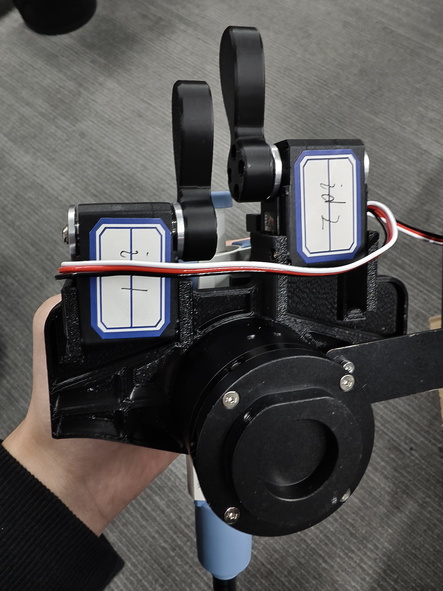
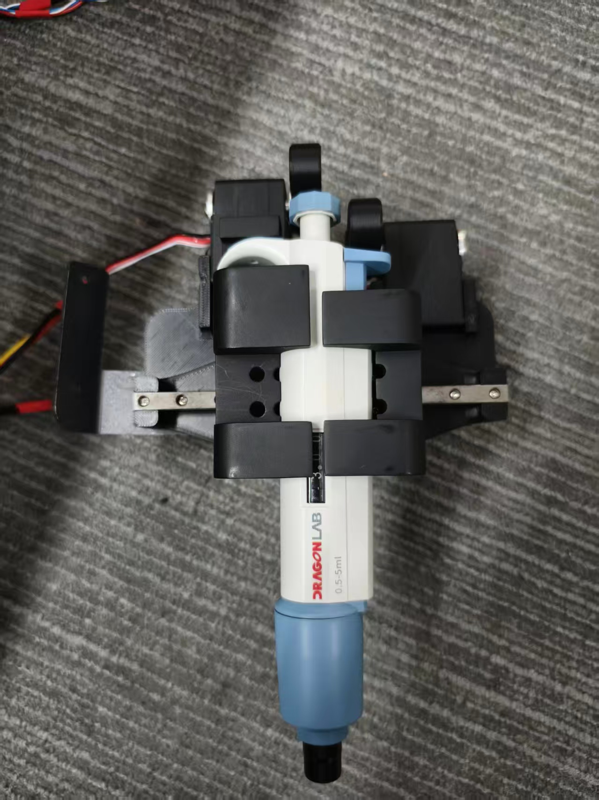
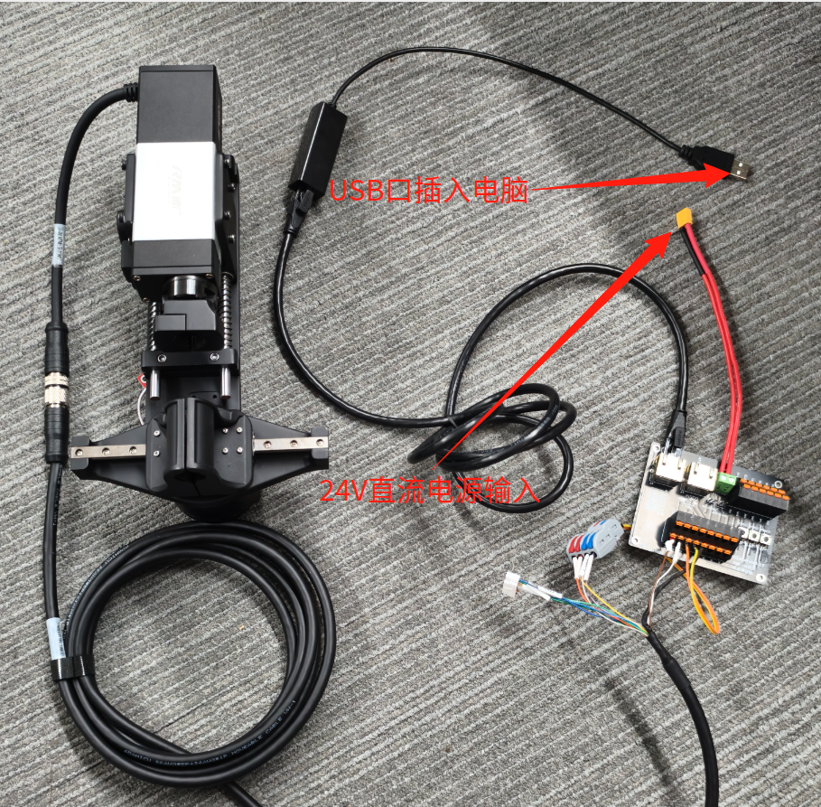
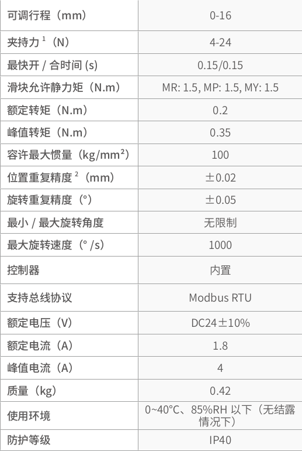

# 设备使用说明

以下所有设备均在 ubuntu20.04 系统上经过测试。

## 移液枪装置

### 硬件接线


该设备需要 24v 直流电源进行输入做整体供电，该设备包括 2 个舵机和 1 个关节电机。舵机需使用 microUSB 口进行驱动，关节电机需使用 CAN 模块进行驱动。

### 舵机驱动

代码文件位置：`Biology-Lab_Project/FTServo_Python/hls`

插入设备号后需要给设备端口加权限：

```bash
sudo chmod 777 /dev/ttyUSB0
```

双舵机设备ID号



图中左边的舵机ID为1，右边舵机ID为2。（ps：如果设备上就只有一个舵机的默认ID号为1）

上图中2个舵机的位置为 2048。

代码位置：Biology-Lab_Project/FTServo_Python/hls/write.py

```python
# 舵机(ID1)
scs_comm_result, scs_error = packetHandler.WritePosEx(1, 2048, 80, 80, 800)  # 发送位置命令，参数含义依次为ID, 目标位置, 速度, 加速度, 力矩
if scs_comm_result != COMM_SUCCESS:
    print("%s" % packetHandler.getTxRxResult(scs_comm_result))  # 通信失败错误信息
elif scs_error != 0:
    print("%s" % packetHandler.getRxPacketError(scs_error))  # 协议错误信息

# 舵机(ID2)
scs_comm_result, scs_error = packetHandler.WritePosEx(2, 2048, 80, 80, 800)  # 发送位置命令，参数含义依次为ID, 目标位置, 速度, 加速度, 力矩
if scs_comm_result != COMM_SUCCESS:
    print("%s" % packetHandler.getTxRxResult(scs_comm_result))
elif scs_error != 0:
    print("%s" % packetHandler.getRxPacketError(scs_error))
```

如需它们进行工作，需要将ID1位置设备为3000，ID2设置为800：

```python
# 舵机(ID1)
scs_comm_result, scs_error = packetHandler.WritePosEx(1, 3000, 80, 80, 800)  # 发送位置命令，参数含义依次为ID, 目标位置, 速度, 加速度, 力矩
if scs_comm_result != COMM_SUCCESS:
    print("%s" % packetHandler.getTxRxResult(scs_comm_result))  # 通信失败错误信息
elif scs_error != 0:
    print("%s" % packetHandler.getRxPacketError(scs_error))  # 协议错误信息

# 舵机(ID2)
scs_comm_result, scs_error = packetHandler.WritePosEx(2, 800, 80, 80, 800)  # 发送位置命令，参数含义依次为ID, 目标位置, 速度, 加速度, 力矩
if scs_comm_result != COMM_SUCCESS:
    print("%s" % packetHandler.getTxRxResult(scs_comm_result))
elif scs_error != 0:
    print("%s" % packetHandler.getRxPacketError(scs_error))
```

具体位置值、力矩需根据工作场景自行调整。


其中常用的为电机位置控制以及校准零位。

电机控制代码在`FTServo_Python/hls`下的 write.py 中。

校准零点的代码在`FTServo_Python/hls`下的 ofscal.py 中。

各舵机使用 ofscal.py 脚本调整好零点，如需调整零点，自行对其调整。

或者下载调试软件对其调整，调试软件下载：

[FD1.9.8.5(250729).7z](https://gitee.com/ftservo/fddebug/blob/master/FD1.9.8.5(250729).7z)

该软件必须联网在 Windows 系统下使用。


write.py 内容如下：

```python
#!/usr/bin/env python
#
# *********     Gen Write Example      *********
#
#
# Available SCServo model on this example : All models using Protocol SCS
# This example is tested with a SCServo(HLS), and an URT
#

import sys
import os
import time

sys.path.append("..")  # 将上级目录加入模块搜索路径，方便导入自定义库
from scservo_sdk import *                      # 导入FTServo SDK库中的所有内容


# 初始化串口端口处理实例
# 设置串口路径
# 获取PortHandlerLinux或PortHandlerWindows的方法和成员
portHandler = PortHandler('/dev/ttyUSB0')  # Linux下的串口设备路径示例

# 初始化协议处理实例
# 获取协议相关的方法和成员
packetHandler = hls(portHandler)  # 使用hls协议类，绑定端口处理实例
    
# 打开串口
if portHandler.openPort():
    print("Succeeded to open the port")  # 打开成功提示
else:
    print("Failed to open the port")  # 打开失败提示
    quit()  # 退出程序

# 设置串口波特率为1000000
if portHandler.setBaudRate(1000000):
    print("Succeeded to change the baudrate")  # 设置成功提示
else:
    print("Failed to change the baudrate")  # 设置失败提示
    quit()  # 退出程序

# 舵机(ID1)
scs_comm_result, scs_error = packetHandler.WritePosEx(1, 3500, 80, 80, 800)  # 发送位置命令，参数含义依次为ID, 目标位置, 速度, 加速度, 力矩
if scs_comm_result != COMM_SUCCESS:
    print("%s" % packetHandler.getTxRxResult(scs_comm_result))  # 通信失败错误信息
elif scs_error != 0:
    print("%s" % packetHandler.getRxPacketError(scs_error))  # 协议错误信息

# 等待时间，确保舵机运动完成
time.sleep(1) 

# 舵机(ID2)
scs_comm_result, scs_error = packetHandler.WritePosEx(2, 800, 80, 80, 800)  # 发送位置命令，参数含义依次为ID, 目标位置, 速度, 加速度, 力矩
if scs_comm_result != COMM_SUCCESS:
    print("%s" % packetHandler.getTxRxResult(scs_comm_result))
elif scs_error != 0:
    print("%s" % packetHandler.getRxPacketError(scs_error))

# 等待时间，确保运动完成
time.sleep(1)

# 关闭串口
portHandler.closePort()
```


ofscal.py 内容如下：

```python
#!/usr/bin/env python
#
# *********     Ping Example      *********
#
#
# Available SCServo model on this example : All models using Protocol SCS
# This example is tested with a SCServo(HLS), and an URT
#

import sys
import os

sys.path.append("..")  # 将上级目录加入模块搜索路径，方便导入自定义库
from scservo_sdk import *  # 导入FTServo SDK库中的所有内容


# 初始化串口端口处理实例
# 设置串口路径，Linux示例为/dev/ttyUSB0
portHandler = PortHandler('/dev/ttyUSB0')

# 初始化协议处理实例，绑定端口处理实例
packetHandler = hls(portHandler)

# 打开串口
if portHandler.openPort():
    print("Succeeded to open the port")  # 打开成功提示
else:
    print("Failed to open the port")  # 打开失败提示
    quit()  # 退出程序

# 设置串口波特率为1000000
if portHandler.setBaudRate(1000000):
    print("Succeeded to change the baudrate")  # 设置成功提示
else:
    print("Failed to change the baudrate")  # 设置失败提示
    quit()  # 退出程序

# 发送舵机当前位置校准命令，将ID为1的舵机当前位置校准为1024
scs_comm_result, scs_error = packetHandler.reOfsCal(1, 1024)
if scs_comm_result != COMM_SUCCESS:
    # 通信失败时打印错误信息
    print("%s" % packetHandler.getTxRxResult(scs_comm_result))
else:
    # 校准成功时打印提示信息
    print("[ID:%03d] ofs cal Succeeded." % (1))
if scs_error != 0:
    # 协议错误时打印错误信息
    print("%s" % packetHandler.getRxPacketError(scs_error))

# 关闭串口
portHandler.closePort()
```


### 关节电机驱动

代码文件位置：`Biology-Lab_Project/agx_driver_api`

依赖安装：

```bash
cd agx_driver_api

pip3 install -e .
```

can 模块使能：

```bash
cd agx_driver_api/gripper_sdk

bash can_activate.sh can0 1000000
```

我们提供了demo示例，代码文件放置在`Biology-Lab_Project/agx_driver_api/gripper_sdk/demo`中：

- gripper_ctrl_demo.py ：驱动电机夹爪开合(移动范围0~1.5rad)。
- get_motor_info.py ： 获取电机信息，包括了电机当前位置、速度、温度。
- set_current_limit.py ：设置电机电流限制，默认为 800 mh，如当前夹持力不满足可以调高限制电流值，不超过5000mh。
- set_zero.py ：设置电机当前位置为零点。


移液枪安装位置：




## 操作试管装置

### 硬件接线


该设备需要 24v 直流电源进行输入做整体供电，该设备包括 1 个舵机、1 个一体式伺服旋转电机和 1 个关节电机。舵机需使用 microUSB 口进行驱动，关节电机需使用CAN模块进行驱动，一体式伺服旋转电机需使用 485转USB 进行驱动。

### 舵机驱动

代码文件位置：`Bio2logy-Lab_Project/FTServo_Python/hls`

该设备使用的是一个舵机，所以默认ID为1

驱动代码仍然使用`write.py`文件。

```python
# 舵机(ID1)
scs_comm_result, scs_error = packetHandler.WritePosEx(1, 0, 80, 80, 800)  # 发送位置命令，参数含义依次为ID, 目标位置, 速度, 加速度, 力矩
if scs_comm_result != COMM_SUCCESS:
    print("%s" % packetHandler.getTxRxResult(scs_comm_result))  # 通信失败错误信息
elif scs_error != 0:
    print("%s" % packetHandler.getRxPacketError(scs_error))  # 协议错误信息
```

需要注意的是该电机不工作时位置为0，工作时会将一体式伺服电机往下推压，位置值为800，具体的位置值和力矩需根据使用场景自行调整。

### 一体式伺服电机驱动



安装驱动模块：

```bash
cd Biology-Lab_Project/tcp_pylibrm-0.0.8

pip install -e .
```

开始下载 py 库可能会遇到一些模块没有安装，需要根据反馈信息安装缺少的模块。

设备连接：

```bash
from RMAxis import Axis_V6
# 设备id为1代表连接的是夹持机构
axis_rtu =Axis_V6.create_modbus_rtu('/dev/ttyUSB0', 115200, 1)
# 设备id为1代表连接的是旋转机构
axis_rtu2 =Axis_V6.create_modbus_rtu('/dev/ttyUSB0', 115200, 2)
```

接下来就可以使用 axis_rtu、axis_rtu2 来调用各种控制接口。

快速上手demo：`tcp_pylibrm-0.0.8/demo.py`

完整的接口示例，请查看 `tcp_pylibrm-0.0.8/pylibrm`下的 `example.py`文件。

下面列举一些常用接口。

```bash
#精密推压 (距离10mm，受力50%，速度系数 0，冲击系数 0 ，力定位范围0.1N，稳压时间 100ms)
axis_rtu.precise_push(10,0.5, 0, 0, 0.1, 100)

##绝对运动 (位置10mm，速度50mm/s，加速度 500mm/s2，减速度 500mm/s2 ，力定位范围0.1N)
axis_rtu.move_absolute(10,50, 500, 500, 0.1)

#推压运动 (距离10mm，速度 20mm/s，加速度 500mm/s2，出力15%，位置范围0.1mm，时间范围500ms)
axis_rtu.push(10, 20, 500, 0.15, 0.1, 500)

#精密推压（距离10mm,受力10N,速度系数1，冲击系数0，力定位范围0.1N，稳压时,500ms）
axis_rtu.precise_push(10,10,1,0,0.1,500)

#Z回原点(距离10mm,速度20mm/s,加速度100mm/s2,出力15%,定位范围0.1mm)
axis_rtu.go_home_z(10,20,100,0.15,0.1)

#精密触碰(距离10mm,速度20mm/s,加速度100mm/s2,力阈值 0.1N,定位范围0.1mm)
axis_rtu.precise_touch(10,20,100,0.1,0.1)

##重置错误
axis_rtu.reset_error()

##重置力
axis_rtu.reset_force()

##停止
axis_rtu.stop()

##获取当前位置
axis_rtu.position()

##获取当前速度
axis_rtu.velocity()

##获取当前位力矩
axis_rtu.torque()
```

注意：上述几种控制方式除了绝对运动以外，其他几种都是相对运动。


该电机参数表如下：



更多细节以及操作案例，例如《如何编辑指令实现快速柔性工作》、《旋转机构快速柔性扭紧》，请查看[产品使用手册](https://rmaixis.oss-cn-shanghai.aliyuncs.com/product%20support/manual/20250818/RM-RGM%20%E4%BA%A7%E5%93%81%E7%94%A8%E6%88%B7%E6%89%8B%E5%86%8C.pdf)。

### 关节电机驱动

代码文件位置：`Biology-Lab_Project/agx_driver_api`

依赖安装：

```bash
cd agx_driver_api

pip3 install -e .
```

can 模块使能：

```bash
cd agx_driver_api/gripper_sdk

bash can_activate.sh can0 1000000
```

我们提供了demo示例，代码文件放置在`Biology-Lab_Project/agx_driver_api/gripper_sdk/demo`中：

- gripper_ctrl_demo.py ：驱动电机夹爪开合(移动范围0~1.5rad)。
- get_motor_info.py ： 获取电机信息，包括了电机当前位置、速度、温度。
- set_current_limit.py ：设置电机电流限制，默认为 800 mh，如当前夹持力不满足可以调高限制电流值，不超过5000mh。
- set_zero.py ：设置电机当前位置为零点。

