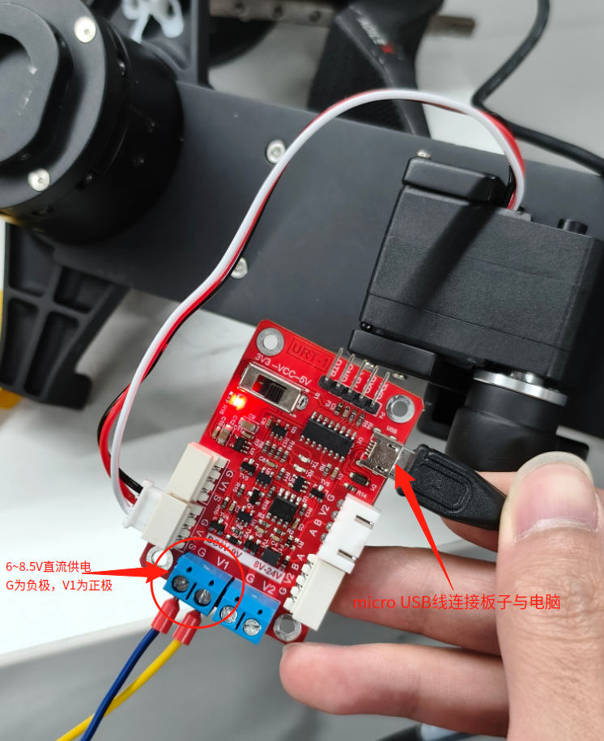

# 设备使用说明

以下所有设备均在 ubuntu20.04 系统上经过测试。

## 一体式伺服旋转夹爪

### 硬件接线


调试板部分：


### 软件驱动

安装驱动模块：

```bash
cd tcp_pylibrm-0.0.8

pip install -e .
```

开始下载 py 库可能会遇到一些模块没有安装，需要根据反馈信息安装缺少的模块。

设备连接：

```bash
from RMAxis import Axis_V6
# 设备id为1代表连接的是夹持机构
axis_rtu =Axis_V6.create_modbus_rtu('/dev/ttyUSB0', 115200, 1)
# 设备id为1代表连接的是旋转机构
axis_rtu2 =Axis_V6.create_modbus_rtu('/dev/ttyUSB0', 115200, 2)
```

接下来就可以使用 axis_rtu、axis_rtu2 来调用各种控制接口。

完整的接口示例，请查看 `tcp_pylibrm-0.0.8/pylibrm`下的 `example.py`文件。

快速上手demo：`tcp_pylibrm-0.0.8/demo.py`

下面列举一些常用接口。

```bash
#精密推压 (距离10mm，受力50%，速度系数 0，冲击系数 0 ，力定位范围0.1N，稳压时间 100ms)
axis_rtu.precise_push(10,0.5, 0, 0, 0.1, 100)

##绝对运动 (位置10mm，速度50mm/s，加速度 500mm/s2，减速度 500mm/s2 ，力定位范围0.1N)
axis_rtu.move_absolute(10,50, 500, 500, 0.1)

#推压运动 (距离10mm，速度 20mm/s，加速度 500mm/s2，出力15%，位置范围0.1mm，时间范围500ms)
axis_rtu.push(10, 20, 500, 0.15, 0.1, 500)

#精密推压（距离10mm,受力10N,速度系数1，冲击系数0，力定位范围0.1N，稳压时,500ms）
axis_rtu.precise_push(10,10,1,0,0.1,500)

#Z回原点(距离10mm,速度20mm/s,加速度100mm/s2,出力15%,定位范围0.1mm)
axis_rtu.go_home_z(10,20,100,0.15,0.1)

#精密触碰(距离10mm,速度20mm/s,加速度100mm/s2,力阈值 0.1N,定位范围0.1mm)
axis_rtu.precise_touch(10,20,100,0.1,0.1)

##重置错误
axis_rtu.reset_error()

##重置力
axis_rtu.reset_force()

##停止
axis_rtu.stop()

##获取当前位置
axis_rtu.position()

##获取当前速度
axis_rtu.velocity()

##获取当前位力矩
axis_rtu.torque()
```

注意：上述几种控制方式除了绝对运动以外，其他几种都是相对运动。


该电机参数表如下：


更多细节以及操作案例，例如《如何编辑指令实现快速柔性工作》、《旋转机构快速柔性扭紧》，请查看[产品使用手册](https://rmaixis.oss-cn-shanghai.aliyuncs.com/product%20support/manual/20250818/RM-RGM%20%E4%BA%A7%E5%93%81%E7%94%A8%E6%88%B7%E6%89%8B%E5%86%8C.pdf)。


## Feetech HLS 舵机

### 硬件接线



双舵机设备ID号


图中左边的舵机ID为1，右边舵机ID为2。（ps：如果设备上就只有一个舵机的默认ID号为1）


其中常用的为电机位置控制以及校准零位。

电机控制代码在`FTServo_Python/hls`下的 write.py 中。

校准零点的代码在`FTServo_Python/hls`下的 ofscal.py 中。

各舵机使用 ofscal.py 脚本调整好零点，如需调整零点，自行对其调整。

或者下载调试软件对其调整，调试软件下载：

[FD1.9.8.5(250729).7z](https://gitee.com/ftservo/fddebug/blob/master/FD1.9.8.5(250729).7z)

该软件必须联网在 Windows 系统下使用。


write.py 内容如下：

```python
#!/usr/bin/env python
#
# *********     Gen Write Example      *********
#
#
# Available SCServo model on this example : All models using Protocol SCS
# This example is tested with a SCServo(HLS), and an URT
#

import sys
import os
import time

sys.path.append("..")  # 将上级目录加入模块搜索路径，方便导入自定义库
from scservo_sdk import *                      # 导入FTServo SDK库中的所有内容


# 初始化串口端口处理实例
# 设置串口路径
# 获取PortHandlerLinux或PortHandlerWindows的方法和成员
portHandler = PortHandler('/dev/ttyUSB0')  # Linux下的串口设备路径示例

# 初始化协议处理实例
# 获取协议相关的方法和成员
packetHandler = hls(portHandler)  # 使用hls协议类，绑定端口处理实例
    
# 打开串口
if portHandler.openPort():
    print("Succeeded to open the port")  # 打开成功提示
else:
    print("Failed to open the port")  # 打开失败提示
    quit()  # 退出程序

# 设置串口波特率为1000000
if portHandler.setBaudRate(1000000):
    print("Succeeded to change the baudrate")  # 设置成功提示
else:
    print("Failed to change the baudrate")  # 设置失败提示
    quit()  # 退出程序

# 舵机(ID1)
scs_comm_result, scs_error = packetHandler.WritePosEx(1, 3500, 80, 80, 800)  # 发送位置命令，参数含义依次为ID, 目标位置, 速度, 加速度, 力矩
if scs_comm_result != COMM_SUCCESS:
    print("%s" % packetHandler.getTxRxResult(scs_comm_result))  # 通信失败错误信息
elif scs_error != 0:
    print("%s" % packetHandler.getRxPacketError(scs_error))  # 协议错误信息

# 等待时间，确保舵机运动完成
time.sleep(1) 

# 舵机(ID2)
scs_comm_result, scs_error = packetHandler.WritePosEx(2, 800, 80, 80, 800)  # 发送位置命令，参数含义依次为ID, 目标位置, 速度, 加速度, 力矩
if scs_comm_result != COMM_SUCCESS:
    print("%s" % packetHandler.getTxRxResult(scs_comm_result))
elif scs_error != 0:
    print("%s" % packetHandler.getRxPacketError(scs_error))

# 等待时间，确保运动完成
time.sleep(1)

# 关闭串口
portHandler.closePort()
```


ofscal.py 内容如下：

```python
#!/usr/bin/env python
#
# *********     Gen Write Example      *********
#
#
# Available SCServo model on this example : All models using Protocol SCS
# This example is tested with a SCServo(HLS), and an URT
#

import sys
import os
import time

sys.path.append("..")  # 将上级目录加入模块搜索路径，方便导入自定义库
from scservo_sdk import *                      # 导入FTServo SDK库中的所有内容


# 初始化串口端口处理实例
# 设置串口路径
# 获取PortHandlerLinux或PortHandlerWindows的方法和成员
portHandler = PortHandler('/dev/ttyUSB0')  # Linux下的串口设备路径示例

# 初始化协议处理实例
# 获取协议相关的方法和成员
packetHandler = hls(portHandler)  # 使用hls协议类，绑定端口处理实例
    
# 打开串口
if portHandler.openPort():
    print("Succeeded to open the port")  # 打开成功提示
else:
    print("Failed to open the port")  # 打开失败提示
    quit()  # 退出程序

# 设置串口波特率为1000000
if portHandler.setBaudRate(1000000):
    print("Succeeded to change the baudrate")  # 设置成功提示
else:
    print("Failed to change the baudrate")  # 设置失败提示
    quit()  # 退出程序

# 舵机(ID1)
scs_comm_result, scs_error = packetHandler.WritePosEx(1, 1024, 80, 80, 1000)  # 发送位置命令，参数含义依次为ID, 目标位置, 速度, 加速度, 力矩
if scs_comm_result != COMM_SUCCESS:
    print("%s" % packetHandler.getTxRxResult(scs_comm_result))  # 通信失败错误信息
elif scs_error != 0:
    print("%s" % packetHandler.getRxPacketError(scs_error))  # 协议错误信息

# 等待时间，确保舵机运动完成
time.sleep(1) 

# 舵机(ID2)
scs_comm_result, scs_error = packetHandler.WritePosEx(2, 0, 80, 80, 500)  # 发送位置命令
if scs_comm_result != COMM_SUCCESS:
    print("%s" % packetHandler.getTxRxResult(scs_comm_result))
elif scs_error != 0:
    print("%s" % packetHandler.getRxPacketError(scs_error))

# 等待时间，确保运动完成
time.sleep(1)

# 关闭串口
portHandler.closePort()
```


## piper 7号电机

### 硬件接线

待定。。。

### ### 控制夹爪demo

```python
from gripper_sdk import *  # 导入gripper_sdk中的所有功能
import time  

if __name__ == "__main__": 
    controller = DriverApi()  # 创建驱动API的控制器实例
    controller.ConnectPort()  # 连接到设备端口
    controller.Enable()  # 使能设备
    print("Enabling...")  # 打印使能提示
    while controller.isOk():  # 循环检测设备状态是否正常
        if controller.GetEnableStatus():  # 如果设备已经使能
            print("Enable successfully")  # 打印使能成功提示
            print("move to 1.5 rad pos")  # 打印移动到1.5弧度位置提示
            controller.GripperCtrl(1.5)  # 控制设备移动到1.5弧度位置
            time.sleep(1.1)  # 等待1.1秒，确保动作完成
            print("move to 0 rad pos")  # 打印移动到0弧度位置提示
            controller.GripperCtrl(0)  # 控制设备移动到0弧度位置
            time.sleep(1.1)  # 等待1.1秒
            print("Disabling...")  # 打印禁用提示
            controller.Disable()  # 禁用设备
            exit(0)  # 退出程序
```

### 设置零位demo

```python
from gripper_sdk import *  # 导入gripper_sdk中的所有功能
import time  

if __name__ == "__main__":  
    controller = DriverApi()  # 创建驱动API的控制器实例
    controller.ConnectPort()  # 连接到设备端口
    # 设置零点必须失能
    controller.Disable()  # 禁用设备，确保安全设置零点
    # 设定零点
    a = controller.SetZero()  # 发送设置零点命令
    while True:  # 循环等待零点设置响应
        # 检测设置零点是否成功
        if(controller.GetRespSetZero().msg.zero_val == 0xAC):  # 判断响应消息中的零点值是否为0xAC，表示成功
            print(controller.GetRespSetZero())  # 打印响应消息
            print("Set zero successfully!!")  # 打印成功提示
            controller.ClearRespSetZero()  # 清除零点响应消息缓存
            exit(0)  # 退出程序
        time.sleep(0.01)  # 每次循环等待10毫秒，避免CPU占用过高
    print("Is Not Ok, exit")  # 如果循环结束，打印失败提示
```


### 获取电机信息demo

```python
from gripper_sdk import *  # 导入gripper_sdk中的所有功能
import time  

if __name__ == "__main__":  # 判断是否为主程序入口
    controller = DriverApi()  # 创建驱动API的控制器实例
    controller.ConnectPort()  # 连接到设备端口
    while controller.isOk():  # 循环检测设备状态是否正常
       
        gripper_pos = controller.GetPos()  # 获取电机当前位置，单位：弧度(rad)
        print("夹爪当前位置：", gripper_pos)  # 打印当前位置
        
        motor_vel = controller.GetVel()  # 获取电机当前速度,单位：rad/s
        print("电机当前速度：", motor_vel)  # 打印电机速度
        
        motor_temp = controller.GetTemp()  # 获取电机温度,单位：摄氏度(℃)
        print("电机温度：", motor_temp)  # 打印电机温度
        
        time.sleep(0.01)  # 每次循环等待10毫秒，避免CPU占用过高
```

